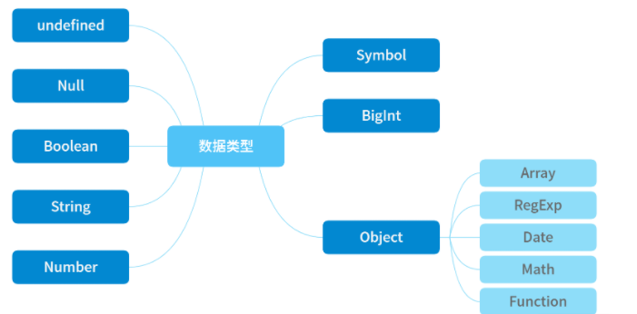

---

title: js的数据类型

meta:
  - name: description
    content: js的数据类型
  - name: keywords
    content: js的数据类型

created: 2021/03/20

updated: 2021/03/20
 
tags:
  - JavaScript核心

---

### 数据类型概念
JavaScript 的数据类型有下图所示的 8 种：

 

其中，前 7 种类型为基础类型，最后 1 种（Object）为引用类型，也是你需要重点关注的，因为它在日常工作中是使用得最频繁，也是需要关注最多技术细节的数据类型。

而引用数据类型（Object）又分为图上这几种常见的类型：Array - 数组对象、RegExp - 正则对象、Date - 日期对象、Math - 数学函数、Function - 函数对象。

在这里，我想先请你重点了解下面两点，因为各种 JavaScript 的数据类型最后都会在初始化之后放在不同的内存中，因此上面的数据类型大致可以分成两类来进行存储：

- 基础类型存储在栈内存，被引用或拷贝时，会创建一个完全相等的变量；
- 引用类型存储在堆内存，存储的是地址，多个引用指向同一个地址，这里会涉及一个“共享”的概念。

关于引用类型下面直接通过两段代码来讲解，让你深入理解一下核心“共享”的概念。

```js
let a = {

  name: 'lee',

  age: 18

}

let b = a;

console.log(a.name);  //第一个console 'lee'

b.name = 'son';

console.log(a.name);  //第二个console 'son'

console.log(b.name);  //第三个console 'son'

```

这道题比较简单，我们可以看到第一个 console 打出来 name 是 'lee'，这应该没什么疑问；但是在执行了 b.name='son' 之后，结果你会发现 a 和 b 的属性 name 都是 'son'，第二个和第三个打印结果是一样的，这里就体现了引用类型的“共享”的特性，即这两个值都存在同一块内存中共享，一个发生了改变，另外一个也随之跟着变化。

下面我们再看一段代码，它是比题目一稍复杂一些的对象属性变化问题。

```js
let a = {

  name: 'Julia',

  age: 20

}

function change(o) {

  o.age = 24;

  o = {

    name: 'Kath',

    age: 30

  }

  return o;

}

let b = change(a);     

console.log(b.age);    // 第一个console '30'

console.log(a.age);    // 第二个console '24'

```
这道题涉及了 function，你通过上述代码可以看到第一个 console 的结果是 30，b 最后打印结果是 {name: "Kath", age: 30}；第二个 console 的返回结果是 24，而 a 最后的打印结果是 {name: "Julia", age: 24}。

是不是和你预想的有些区别？你要注意的是，这里的 function 和 return 带来了不一样的东西。

原因在于：函数传参进来的 o，传递的是对象在堆中的内存地址值，通过调用 o.age = 24（第 7 行代码）确实改变了 a 对象的 age 属性；但是第 12 行代码的 return 却又把 o 变成了另一个内存地址，将 {name: "Kath", age: 30} 存入其中，最后返回 b 的值就变成了 {name: "Kath", age: 30}。而如果把第 12 行去掉，那么 b 就会返回 undefined。这里你可以再仔细琢磨一下。

讲完数据类型的基本概念，我们继续看下一部分，如何对数据类型进行检测，这也是比较重要的问题。

### 数据类型检测
数据类型的判断方法其实有很多种，比如 typeof , instanceof, Object.prototype.toString，下面我来重点介绍三种在工作中经常会遇到的数据类型检测方法。

### 第一种判断方法：typeof
这是比较常用的一种，那么我们通过一段代码来快速回顾一下这个方法。
```js
typeof 1 // 'number'

typeof '1' // 'string'

typeof undefined // 'undefined'

typeof true // 'boolean'

typeof Symbol() // 'symbol'

typeof null // 'object'

typeof [] // 'object'

typeof {} // 'object'

typeof console // 'object'

typeof console.log // 'function'

```
你可以看到，前 6 个都是基础数据类型，而为什么第 6 个 null 的 typeof 是 'object' 呢？这里要和你强调一下，虽然 typeof null 会输出 object，但这只是 JS 存在的一个悠久 Bug，不代表 null 就是引用数据类型，并且 null 本身也不是对象。因此，null 在 typeof 之后返回的是有问题的结果，不能作为判断 null 的方法。如果你需要在 if 语句中判断是否为 null，直接通过 ‘===null’来判断就好。

此外还要注意，引用数据类型 Object，用 typeof 来判断的话，除了 function 会判断为 OK 以外，其余都是 'object'，是无法判断出来的。

### 第二种判断方法：instanceof
instanceof的判断逻辑是： 从当前引用的proto一层一层顺着原型链往上找，能否找到对应的prototype。找到了就返回true。

```js
let Car = function() {}

let benz = new Car()

benz instanceof Car // true

let car = new String('Mercedes Benz')

car instanceof String // true

let str = 'Covid-19'

str instanceof String // false

```

上面就是用 instanceof 方法判断数据类型的大致流程，那么如果让你自己实现一个 instanceof 的底层实现，应该怎么写呢？请看下面的代码。

```js
function instance_of(L, R) {//L 表示左表达式，R 表示右表达式 

    var O = R.prototype;   // 取 R 的显示原型 

    L = L.__proto__;  // 取 L 的隐式原型

    while (true) {    

        if (L === null)      

             return false;   

        if (O === L)  // 当 O 显式原型 严格等于  L隐式原型 时，返回true

             return true;   

        L = L.__proto__;  

    }

}
```

现在你知道了两种判断数据类型的方法，那么它们之间有什么差异呢？我总结了下面两点：

- instanceof 可以准确地判断复杂引用数据类型，但是不能正确判断基础数据类型；
- 而 typeof 也存在弊端，它虽然可以判断基础数据类型（null 除外），但是引用数据类型中，除了 function 类型以外，其他的也无法判断。

总之，不管单独用 typeof 还是 instanceof，都不能满足所有场景的需求，而只能通过二者混写的方式来判断。但是这种方式判断出来的其实也只是大多数情况，并且写起来也比较难受，你也可以试着写一下。

其实我个人还是比较推荐下面的第三种方法，相比上述两个而言，能更好地解决数据类型检测问题。

### 第三种判断方法：Object.prototype.toString
toString() 是 Object 的原型方法，调用该方法，可以统一返回格式为 “[object Xxx]” 的字符串，其中 Xxx 就是对象的类型。对于 Object 对象，直接调用 toString() 就能返回 [object Object]；而对于其他对象，则需要通过 call 来调用，才能返回正确的类型信息。我们来看一下代码
```js
Object.prototype.toString({})       // "[object Object]"

Object.prototype.toString.call({})  // 同上结果，加上call也ok

Object.prototype.toString.call(1)    // "[object Number]"

Object.prototype.toString.call('1')  // "[object String]"

Object.prototype.toString.call(true)  // "[object Boolean]"

Object.prototype.toString.call(function(){})  // "[object Function]"

Object.prototype.toString.call(null)   //"[object Null]"

Object.prototype.toString.call(undefined) //"[object Undefined]"

Object.prototype.toString.call(/123/g)    //"[object RegExp]"

Object.prototype.toString.call(new Date()) //"[object Date]"

Object.prototype.toString.call([])       //"[object Array]"

Object.prototype.toString.call(document)  //"[object HTMLDocument]"

Object.prototype.toString.call(window)   //"[object Window]"

```

从上面这段代码可以看出，Object.prototype.toString.call() 可以很好地判断引用类型，甚至可以把 document 和 window 都区分开来。

但是在写判断条件的时候一定要注意，使用这个方法最后返回统一字符串格式为 "[object Xxx]" ，而这里字符串里面的 "Xxx" ，第一个首字母要大写（注意：使用 typeof 返回的是小写），这里需要多加留意。

那么下面来实现一个全局通用的数据类型判断方法，来加深你的理解，代码如下。
```js
function getType(obj){

  let type  = typeof obj;

  if (type !== "object") {    // 先进行typeof判断，如果是基础数据类型，直接返回

    return type;

  }

  // 对于typeof返回结果是object的，再进行如下的判断，正则返回结果

  return Object.prototype.toString.call(obj).replace(/^\[object (\S+)\]$/, '$1');  // 注意正则中间有个空格

}

/* 代码验证，需要注意大小写，哪些是typeof判断，哪些是toString判断？思考下 */

getType([])     // "Array" typeof []是object，因此toString返回

getType('123')  // "string" typeof 直接返回

getType(window) // "Window" toString返回

getType(null)   // "Null"首字母大写，typeof null是object，需toString来判断

getType(undefined)   // "undefined" typeof 直接返回

getType()            // "undefined" typeof 直接返回

getType(function(){}) // "function" typeof能判断，因此首字母小写

getType(/123/g)      //"RegExp" toString返回

```

到这里，数据类型检测的三种方法就介绍完了，最后也给出来了示例代码，希望你可以对比着来学习、使用，并且不断加深记忆，以便遇到问题时不会手忙脚乱。