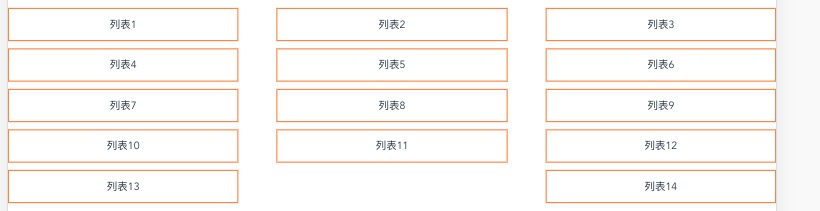

---

title: flex布局 wrap space-between最后一行排列问题

meta:
  - name: description
    content: wrap space-between
  - name: keywords
    content: wrap space-between

created: 2020/05/16

updated: 2020/05/16
 
tags:
  - css

---

## 前言
flex 布局中使用`flex-wrap: wrap;`并使用`justify-content:space-between;`两端对齐使用当最后一排数量不够时，会出现以下布局情况：


```html
// vue中的伪代码

<div class="flex">
  <div class="item" v-for="item in len" :key="item">列表{{item}}</div>
</div>

data(){
	return {
		len : 14
	}
}

.flex{
  display: flex;
  flex-wrap: wrap;
  justify-content:space-between;
  justify-items: center;
  text-align: justify;
}

.item{
  width:30%;
  border:1px solid #ff6600;
  margin-bottom: 10px;
  padding: 10px 5px;
  display: flex;
  justify-content: center;
}

```

 

而想实现的效果为：

 

### 方案1：父级添加after伪类法，解决最后一排数量不够两端分布的情况
```html
// vue中的伪代码

<div class="flex">
  <div class="item" v-for="item in len" :key="item">列表{{item}}</div>
</div>

data(){
	return {
		len : 14
	}
}

.flex{
  display: flex;
  flex-wrap: wrap;
  justify-content:space-between;
  justify-items: center;
  text-align: justify;
}

<!--加上after伪类，解决最后一排数量不够两端分布的情况-->
.flex:after{
  content: '';
  width: 30%;
  border:1px solid transparent;
}

.item{
  width:30%;
  border:1px solid #ff6600;
  margin-bottom: 10px;
  padding: 10px 5px;
  display: flex;
  justify-content: center;
}

```

这种方案存在以下两个问题
- 只适合最后一行不足的情况(最后一行不管是否缺失都添加了伪元素，当最后一行不缺失时多了一行给伪元素)
- 只适合每列有3个的分布情况，如果布局每列有4个，5个


### 方案二：补位添加节点法，这种方案适用于多种排列方式。

原效果
 

目标效果
 


```html
// vue中的伪代码

<div class="flex">
  <div class="item" v-for="item in len" :key="item">
    列表{{item}}
  </div>
  <div class="item-completion" v-for="item in (row - len % row)" :key="item" v-if="completion"></div>
</div>

data(){
	return {
		len: 14, // 列表长度
    row: 5   // 每行放几个
	},
  computed: {
    completion() { // 是否需要伪元素
      return this.len % this.row > 0
    }
  }
}

.flex{
  display: flex;
  flex-wrap: wrap;
  justify-content:space-between;
  justify-items: center;
  text-align: justify;
}

.item-completion{
  content: '';
  width: 18%;
  border:1px solid transparent;
  padding: 5px;
  overflow: hidden;
}

.item{
  width: 18%;
  border: 1px solid #ff6600;
  margin-bottom: 10px;
  padding: 10px 5px;
  display: flex;
  justify-content: center;
}

```

是不是完美解决！~

### 使用grid栅格布局，完美解决多列排版问题。（个人推荐使用这种方法，简单高效，唯一问题是兼容性）

```html
// vue中的伪代码

<div class="grid" :style="{'grid-template-columns': `repeat(${state.row},1fr)`}">
  <div class="list" v-for="item in state.len" :key="item">列表{{item}}</div>
</div>

data(){
	return {
		len: 18, // 列表长度
    row: 5   // 每行放几个
	}
}

.grid{
  display: grid;
  grid-gap: 10px;
}
.list{
  border: 1px solid #ff6600;
  padding: 5px;
}

```

实现效果


是不是代码很简洁，具体相关知识请翻阅 [grid](http://www.ruanyifeng.com/blog/2019/03/grid-layout-tutorial.html) 栅格布局

## 后记
flex虽然大部分情况下都很好用，但是有些特殊情况需要hack。可能这就是为什么又出了[grid](http://www.ruanyifeng.com/blog/2019/03/grid-layout-tutorial.html) 栅格布局的原因吧！


