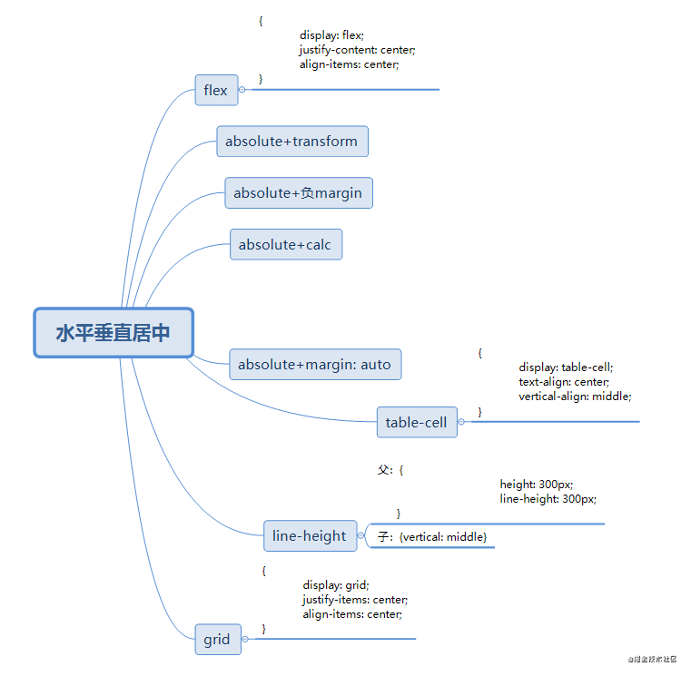

---

title: 元素水平垂直居中

meta:
  - name: description
    content: 元素水平垂直居中
  - name: keywords
    content: 元素水平垂直居中

created: 2021/02/22

updated: 2021/02/22

tags:
  - css

---
## 前言
 


### 方法一：flex布局
flex布局适用于子元素是行内元素、行内块元素、块元素，适用性比较广。
```html
  <style>
      .wrap{
          width: 400px;
          height: 300px;
          background-color: lightcoral;
          display: flex;   //flex代码三件套
          justify-content: center;
          align-items: center;
      }
      .inner{
          width: 40px;
          height: 50px;
          background-color: lightblue;
      }
  </style>
  <div class="wrap">
      <div class="inner"></div>
  </div>
```

### 方法二：absolute + transform
该方法也适用于子元素是行内元素、行内块元素、块元素，适用性比较广。
这是因为 position: absolute; 和 float 属性会隐式地改变元素的 display 类型（display: none;除外）。只要设置了 position: absolute; 和 float 属性中的一个，都会让元素以 display: inline-block; 的方式出现。
```html
  <style>
      .wrap{
          width: 400px;
          height: 300px;
          background-color: lightcoral;
          position: relative;
      }
      .inner{
          background-color: lightblue;
          position: absolute;
          top: 50%;
          left: 50%;
          transform: translate(-50%, -50%);
      }
  </style>
  <div class="wrap">
      <span class="inner">绝对定位+transform</span>
  </div>
```

### 方法三：absolute + 负margin
该方法也适用于子元素是行内元素、行内块元素、块元素，唯一的要求是子元素的 高度 和 宽度 已知的情况。

```html
  <style>
      .wrap{
          width: 400px;
          height: 300px;
          background-color: lightcoral;
          position: relative;
      }
      .inner{
          background-color: lightblue;
          position: absolute;
          top: 50%;
          left: 50%;
          margin-left: -50px;
          margin-top: -40px;
          height: 80px;
          width: 100px;
      }
  </style>
  <div class="wrap">
      <span class="inner"></span>
  </div>

```

### 方法四：absolute + calc
该方法同方法三原理是一样的。利用了 calc 计算好元素的 left 和 top 从而保证了元素的水平垂直居中。

该方法也适用于子元素是行内元素、行内块元素、块元素，唯一的要求是子元素的 高度 和 宽度 已知的情况。

```html
<style>
    .wrap{
        width: 400px;
        height: 300px;
        background-color: lightcoral;
        position: relative;
    }
    .inner{
        background-color: lightblue;
        position: absolute;
        top: calc(50% - 40px);
        left: calc(50% - 50px);
        height: 80px;
        width: 100px;
    }
</style>
<div class="wrap">
    <span class="inner"></span>
</div>

```

### 方法五：absolute + margin:auto
我们知道对于块级元素通过设置 margin: auto; 可以使得元素水平方向居中，但是却不能让其垂直方向居中。
这是为什么呢？这是跟块级元素的特性相关的。如果不设置块级元素的 width 值，块级元素默认 width: 100%; 在水平方向上会铺满占据父级元素。但是如果不设置 height，块级元素却不会自动占据父级元素的高度。这就是块级元素的特点了，能独自占据父级元素一行的，而不是一列。
当我们设置了块级元素的宽度和 margin:auto; 表示块级元素除了本身的宽度以为，水平方向的剩余空间距离父元素左边和右边的 margin 自动分配，也就可以让元素水平居中了。
但是在垂直方向上，块级元素不会自动扩充，它的外部尺寸没有自动充满父元素，也没有剩余空间可说。所以margin：auto不能实现垂直居中。
当我们使用了绝对定位 absolute；top: 0; bottom: 0; 的时候，元素在垂直方向有了自动充满父元素的特点。这时使用 margin: auto; 就会告诉浏览器除去元素本身的高度，那么垂直方向上的剩余空间 margin-top 和 margin-bottom 都是 auto 的，也就是平分剩余空间，从而实现元素垂直方向的居中。
该方法也适用于子元素是行内元素、行内块元素、块元素，唯一的要求是子元素要有 高度 和 宽度 。不然，子元素会完全填充父元素。

```html
<style>
    .wrap{
        width: 400px;
        height: 300px;
        background-color: lightcoral;
        position: relative;
    }
    .inner{
        background-color: lightblue;
        position: absolute;
        left: 0;
        right: 0;
        top: 0;
        bottom: 0;
        height: 80px;
        width: 100px; 
        margin: auto;
        text-align: center;
    }
</style>
<div class="wrap">
    <span class="inner">absolute + margin:auto</span>
</div>

```

### 方法六：借助display:table-cell;
设置父元素 display:table-cell; 让父元素具有 td 元素的特点。同时利用 vertical-align: middle; 让行内元素或者行内块元素垂直居中。text-align: center; 让行内元素或者行内块元素水平居中。

vertical-align: middle; 用来设置的行内元素本身（inline）, 行内块元素（inline-block）本身 或者 td 元素（table-cell box）内容垂直方向的排列方式。

```html
<style>
    .wrap{
        width: 400px;
        height: 300px;
        background-color: lightcoral;
        display: table-cell;
        vertical-align: middle;
        text-align: center;
    }
    .inner{
        background-color: lightblue;
        display: inline-block;
        height: 110px; 
        width: 100px; 
    }
</style>
<div class="wrap">
    <div class="inner">
    </div>
</div>
```

### 方法七：line-height
我们知道对于元素内部是行内元素来说，可以设置 line-height = height; 让行内元素垂直居中，text-align: center; 实现水平居中。这对于子元素是行内元素单行文本很容易实现。
```html
  <style>
      .wrap{
          width: 400px;
          height: 300px;
          line-height: 300px;
          text-align: center;
          background-color: lightcoral;
      }
  </style>
  <div class="wrap">
      <span>line-height: 300px;我是平平无奇的行内元素。</span>
  </div>

```
对于行内块元素就要借助上面说到的 vertical-align 一起实现了。
```html
  <style>
      .wrap{
          width: 400px;
          height: 300px;
          line-height: 300px;
          text-align: center;
          background-color: lightcoral;
      }
      .inner{
          height: 200px; 
          width: 200px; 
          display: inline-block;
          background-color: lightblue;
          vertical-align: middle;
          font-size: 14px;
          line-height: initial;
      }
  </style>
  <div class="wrap">
      <div class="inner">display: inline-block;
      </div>
  </div>

```

### 方法八：最新的方法 grid\
grid的兼容性较差，所以没有流行使用，我们可以提前了解一下。

```html
  <style>
      .wrap{
          display: grid;
          justify-items: center;
          align-items: center;
          width: 400px;
          height: 300px;
          background-color: lightcoral;
      }
      .inner{
          background-color: lightblue;
          height: 110px; 
          width: 100px; 
      }
  </style>
  <div class="wrap">
      <div class="inner"></div>
  </div>

```

