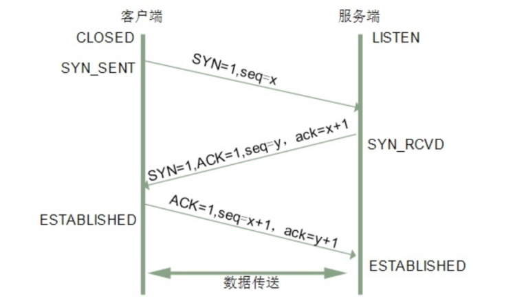
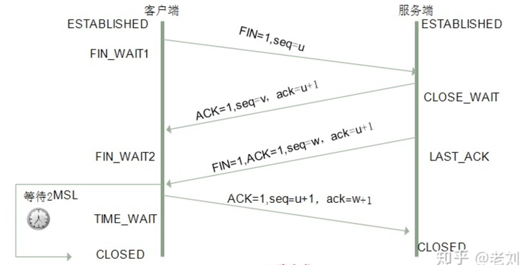

---

title: TCP三次握手和四次挥手

meta:
  - name: description
    content: TCP三次握手和四次挥手
  - name: keywords
    content: TCP三次握手和四次挥手

created: 2021/02/28

updated: 2021/02/28

tags:
  - 网络基础

---
## 三次握手

三次握手(Three-way Handshake)的目的 是为了确认客户端和服务器双方的接受能力和发送能力正常

第一次握手：
客户端给服务端发一个 SYN 同步序列编号 (Synchronize Sequence Numbers)报文，并指明客户端的初始化序列号 ISN (initial sequence number) 。此时客户端处于 SYN_SEND 状态。
如果服务端收到了 那么服务端就能得出结论：客户端的发送能力、服务端的接收能力是正常的。

第二次握手：
服务器收到客户端的 SYN 报文之后，会以自己的 SYN 报文作为应答，并且也是指定了自己的初始化序列号 ISN。同时会把客户端的 ISN + 1 作为ACK 的值，表示自己已经收到了客户端的 SYN，此时服务器处于 SYN_REVD 的状态。
如果客户端收到了 那么客户端就能得到结论：服务端的接收、发送能力，客户端的接收、发送能力是正常的。但是服务器端不知道客户端接收能力是否正常

第三次握手：
客户端收到 SYN 报文之后，会发送一个 ACK 报文，当然，也是一样把服务器的 ISN + 1 作为 ACK 的值，表示已经收到了服务端的 SYN 报文，此时客户端处于 ESTABLISHED 状态。服务器收到 ACK 报文之后，也处于 ESTABLISHED 状态，此时，双方已建立起了连接。
如果服务端收到了 那么服务器端就能咋们所有功能都正常

总结
简而言之 就是客户机首先发出一个SYN消息，服务器使用SYN+ACK应答表示接收到了这个消息，最后客户机再以ACK消息响应 这样双方都处于ESTABLISHED 状态 建立起稳定得连接。

### 四次挥手

数据传输完成，现在要断开连接了,就会通过四次挥手(Four-way handshake)

第一次挥手：客户端发送一个 FIN 报文，报文中会指定一个序列号。此时客户端处于 FIN_WAIT1 状态。
即发出连接释放报文段（FIN=1，序号seq=u），并停止再发送数据，主动关闭TCP连接，进入FIN_WAIT1（终止等待1）状态，等待服务端的确认。

第二次挥手：服务端收到 FIN 之后，会发送 ACK 报文，且把客户端的序列号值 +1 作为 ACK 报文的序列号值，表明已经收到客户端的报文了，此时服务端处于 CLOSE_WAIT 状态。
即服务端收到连接释放报文段后即发出确认报文段（ACK=1，确认号ack=u+1，序号seq=v），服务端进入CLOSE_WAIT（关闭等待）状态，此时的TCP处于半关闭状态，客户端到服务端的连接释放。客户端收到服务端的确认后，进入FIN_WAIT2（终止等待2）状态，等待服务端发出的连接释放报文段。

第三次挥手：如果服务端也想断开连接了，和客户端的第一次挥手一样，发给 FIN 报文，且指定一个序列号。此时服务端处于 LAST_ACK 的状态。
即服务端没有要向客户端发出的数据，服务端发出连接释放报文段（FIN=1，ACK=1，序号seq=w，确认号ack=u+1），服务端进入LAST_ACK（最后确认）状态，等待客户端的确认。

第四次挥手：客户端收到 FIN 之后，一样发送一个 ACK 报文作为应答，且把服务端的序列号值 +1 作为自己 ACK 报文的序列号值，此时客户端处于 TIME_WAIT 状态。需要过一阵子以确保服务端收到自己的 ACK 报文之后才会进入 CLOSED 状态，服务端收到 ACK 报文之后，就处于关闭连接了，处于 CLOSED 状态。

即客户端收到服务端的连接释放报文段后，对此发出确认报文段（ACK=1，seq=u+1，ack=w+1），客户端进入TIME_WAIT（时间等待）状态。此时TCP未释放掉，需要经过时间等待计时器设置的时间2MSL后，客户端才进入CLOSED状态。

## 总结

客户端想断开了 于是发送一个FIN + 序列号seq = u

服务器端收到了 但是很可能并不会立即关闭SOCKET，只能先回复一个ACK(u+1) + 序列号seq = v 告诉客户端 我收到你的FIN了 只有等我所有服务端报文发送完了 我再发送 FIN 报文

等服务器端也想断开了就发送一个 FIN + 序列号seq = w

客户端收到了再发送ACK(w+1)  客户端等2MSL 后进入CLOSED状态 服务器端收到也进入CLOSED 状态