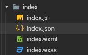

---

title: 基于wepy微信小程序开发

meta:
  - name: description
    content: 基于wepy微信小程序开发
  - name: keywords
    content: 基于wepy微信小程序开发

created: 2020/12/07

updated: 2020/12/07
 
tags:
  - 日常开发

---
### 前言
最近公司有开发微信小程序的需求。至微信小程序刚出来那会踩坑过后，就一直没有怎么做微信小程序了。没事，说干就干。

## 微信小程序开发文档
[微信小程序官方开发文档](https://developers.weixin.qq.com/miniprogram/dev/framework/quickstart/)不得不说，相比2.3年前我看文档来说，现在的文档清晰多了。按照他一步一步做基本不会出现太多问题。项目很顺利的跑起来了。

## WePY与mpvue选择
官方流程跑完了，总觉的那里不对。说好的跟vue开发能无缝衔接呢？一个页面4个文件总觉得变扭。

这个时候[WePY]( https://wepyjs.gitee.io/wepy-docs/)与[mpvue](http://mpvue.com/)就映入眼帘了.

试着跑了2个框架的例子，最终选择了WePY。为什么选择WePY呢：

- WePY是官方出品
- 我只需求做小程序，而不是mpvue宣传的那样一套代码多端使用，太重了

## 引入Vant组件库
在以前开发移动端时用了[Vant](https://vant-contrib.gitee.io/vant/#/zh-CN/)组件库，他有没有小程序版本了。果然[小程序Vant](https://vant-contrib.gitee.io/vant-weapp/#/intro)。但是高兴的太找了，如何把Vant组件集成到WePY中又成了一个问题。

最后通过折腾[github](https://github.com/lh8725473/wpyVant)集成了一版

