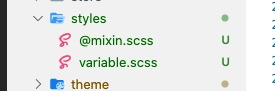
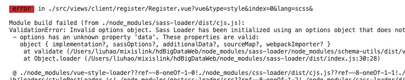

---

title: 记一次sass-loader配置的坑

meta:
  - name: description
    content: 记一次sass-loader配置的坑
  - name: keywords
    content: 记一次sass-loader配置的坑

created: 2020/06/05

updated: 2020/06/05
 
tags:
  - 日常开发

---

### 前言
最近又要做一个新项目的，搭建环境什么的最开心了。废话不多说，撸起袖子就是干。

## scss支持
哎呀！~根据设计稿，好多组件要定制化颜色什么的，没有安装scss支持 
```
yarn add node-sass sass-loader --dev
```

然后定义了`@mixin.scss`和`variable.scss`用于公共样式和主题色定义

 

开开心心在vue组件中使用

```
@import '../../style/variable.scss';
@import '../../style/@mixin.scss';
```

但是想想不对，这样写不是每个vue组件中都需要引用，不是很麻烦么。我们程序员的意义不就是'偷懒'么。有没有什么方法不用重复引用。

### 全局引用
为了自动引用，有了`veu.config.js`以下配置(很久以前在以前项目用过)

```js
module.exports = {
  ...
  css: {
    sourceMap: true,
    loaderOptions: {
      sass: {
        data: `
        @import "~@/style/variable.scss";
        `
      }
    }
  }
  ...
}
```

但是一跑项目结果报错

 

奇怪了为什么报错说没有这个属性呢，以前的项目用的好好的

Google一下.. 大概明白是`sass-loader`版本问题。然后查看以前项目的`sass-loader`版本为V7,现在项目中都V10。查看官方文档可知对应版本属性名是:

- v7: data
- v8: prependData
- v10: additionalData

也不明白为什么这么改(感觉有点坑，每个版本的配置名还不一样)

修改`veu.config.js`中如下
```js
module.exports = {
  ...
  css: {
    sourceMap: true,
    loaderOptions: {
      sass: {
        additionalData: `
        @import "~@/style/variable.scss";
        `
      }
    }
  }
  ...
}
```

再次运行OK!~ 又可以偷懒少些代码了！~

### 后记
每次在创建新的项目时，要么版本保证包的版本不变，如果要用心的包的版本可能配置项上有所不同。


