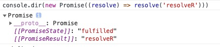
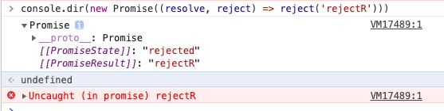

---

title: 手动实现一个简单promise

meta:
  - name: description
    content: 手动实现一个简单promise
  - name: keywords
    content: 手动实现一个简单promise

created: 2020/3/01

updated: 2020/3/01

tags:
  - js365
  - promise

---

## 前言

很多 JavaScript 的初学者都曾感受过被回调地狱支配的恐惧，直至掌握了 Promise 语法才算解脱。虽然很多语言都早已内置了 Promise ，但是 JavaScript 中真正将其发扬光大的还是 `jQuery 1.5` 对 $.ajax 的重构，支持了 `Promise`，而且用法也和 jQuery 推崇的链式调用不谋而合。后来 ES6 出世，大家才开始进入全民 Promise 的时代，再后来 ES8 又引入了 async 语法，让 JavaScript 的异步写法更加优雅。
今天我们就一步一步来实现一个 Promise，如果你还没有用过 Promise，建议先熟悉一下 Promise 语法再来阅读本文。

### 构造函数

在已有的 `Promise/A+` [规范](https://www.ituring.com.cn/article/66566)中并没有规定 promise 对象从何而来，在 `jQuery` 中通过调用 `$.Deferred()` 得到 promise 对象，ES6 中通过实例化 Promise 类得到 promise 对象。这里我们使用 ES 的语法，构造一个类，通过实例化的方式返回 promise 对象。


::: tip
promise三个状态：

- pending：等待中，这是 Promise 的初始状态；
- fulfilled：已结束，正常调用 resolve 的状态；
- rejected：已拒绝，内部出现错误，或者是调用 reject 之后的状态；

:::


我们可以看到 Promise 在运行期间有一个状态，存储在 `[[PromiseState]]` 中。下面我们为 MyPromise 添加一个状态。
```js
//基础变量的定义
const STATUS = {
  PENDING: 'PENDING',
  FULFILLED: 'FULFILLED',
  REJECTED: 'REJECTED'
}

class MyPromise {
  constructor(callback) {
    this.status = STATUS.PENDING

    const resolve = () => {
      // TODO
    }
    const reject = () => {
      // TODO
    }
    try {
      callback(resolve, reject)
    } catch (error) {
      // 出现异常直接进行 reject
      reject(error)
    }
  }
}

```

### 内部结果

除开状态，Promise 内部还有个结果 `[[PromiseResult]]`，用来暂存 resolve/reject 接受的值。

 



继续在构造函数中添加一个内部结果。

```js
const STATUS = {
  PENDING: 'PENDING',
  FULFILLED: 'FULFILLED',
  REJECTED: 'REJECTED'
}

class MyPromise {
  constructor(callback) {
    this.value = undefined
    this.status = STATUS.PENDING

    const resolve = (resolveR) => {
      this.value = resolveR
      // TODO
    }

    const reject = (rejectR) => {
      this.value = rejectR
      // TODO
    }

    try {
      callback(resolve, reject)
    } catch (error) {
      // 出现异常直接进行 reject
      reject(error)
    }
  }
}
```

### 改变状态

接下来，我们需要实现 resolve 和 reject 两个方法，这两个方法在被调用的时候，会改变 promise 对象的状态。只有处于`pending`状态下的promise才能被改变状态。

```js
const STATUS = {
  PENDING: 'PENDING',
  FULFILLED: 'FULFILLED',
  REJECTED: 'REJECTED'
}

class MyPromise {
  constructor(callback) {
    this.value = undefined
    this.status = STATUS.PENDING

    const resolve = (resolveR) => {
      if(this.status === STATUS.PENDING){
        this.status = STATUS.FULFILLED
        this.value = resolveR
      }
    }

    const reject = (rejectR) => {
      if(this.status === STATUS.PENDING){
        this.status = STATUS.REJECTED
        this.value = rejectR
      }
    }

    try {
      callback(resolve, reject)
    } catch (error) {
      // 出现异常直接进行 reject
      reject(error)
    }
  }
}
```

### then和catch方法
接下来我们需要实现 then 和 catch 方法，用过 Promise 的同学肯定知道，then 和 catch 必须返回一个 Promise 对象。

```js
const STATUS = {
  PENDING: 'PENDING',
  FULFILLED: 'FULFILLED',
  REJECTED: 'REJECTED'
}

class MyPromise {
  constructor(callback) {
    this.value = undefined
    this.status = STATUS.PENDING

    const resolve = (resolveR) => {
      if(this.status === STATUS.PENDING){
        this.status = STATUS.FULFILLED
        this.value = resolveR
      }
    }

    const reject = (rejectR) => {
      if(this.status === STATUS.PENDING){
        this.status = STATUS.REJECTED
        this.value = rejectR
      }
    }

    try {
      callback(resolve, reject)
    } catch (error) {
      // 出现异常直接进行 reject
      reject(error)
    }
  }

  then (resolveCb) {
    switch(this.state){
      case STATUS.FULFILLED:
        resolveCb(this.value)
      default:    
    }
    return this
  }

  catch (rejectedCb) {
    switch(this.state){
      case STATUS.REJECTED:
        rejectedCb(this.value)
      default:
    }
    return this  
  }
}
```

### finally方法
finally方法的实现就很简单了。

```js
const STATUS = {
  PENDING: 'PENDING',
  FULFILLED: 'FULFILLED',
  REJECTED: 'REJECTED'
}

class MyPromise {
  constructor(callback) {
    this.value = undefined
    this.status = STATUS.PENDING

    const resolve = (resolveR) => {
      if(this.status === STATUS.PENDING){
        this.status = STATUS.FULFILLED
        this.value = resolveR
      }
    }

    const reject = (rejectR) => {
      if(this.status === STATUS.PENDING){
        this.status = STATUS.REJECTED
        this.value = rejectR
      }
    }

    try {
      callback(resolve, reject)
    } catch (error) {
      // 出现异常直接进行 reject
      reject(error)
    }
  }

  then (resolveCb) {
    switch(this.state){
      case STATUS.FULFILLED:
        resolveCb(this.value)
      default:    
    }
    return this
  }

  catch (rejectedCb) {
    switch(this.state){
      case STATUS.REJECTED:
        rejectedCb(this.value)
      default:
    }
    return this  
  }

  finally (finallyCb) {
    finallyCb()
  }
}
```

## 后记
这里只是简单的实现了一个promise，对于一个完整当然还有好多没有实现的，比如：

::: tip
promise三个状态：

- Promise 类还提供了两个静态方法，直接返回状态已经固定的 promise 对象 resolve/reject 。
- 在 Promise/A+ 规范中，有明确的规定，then 方法返回的是一个新的 promise 对象，而不是直接返回 this；
- 如果我们在调用 then 的时候，如果没有传入任何的参数，按照规范，当前 promise 的值是可以透传到下一个 then 方法的
- promise.all() 和 promise.race()

:::

期待大家的探索实现。