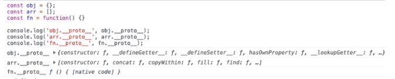

## 前言
鉴于项目需要兼容IE11，项目组内讨论想使用vue3和typescript。vue2对typescript的支持不是很好，所以折中使用[@vue/composition-api](https://github.com/vuejs/composition-api)+vue2+typescript的方式进行开发。这样不仅能使用[compostion api](https://v3.cn.vuejs.org/guide/composition-api-introduction.html#%E4%BB%80%E4%B9%88%E6%98%AF%E7%BB%84%E5%90%88%E5%BC%8F-api)而且对typescript有更好的支持

- 引用类型，都具有对象特性，即可自由扩展属性。
- 引用类型，都有一个隐式原型 __proto__ 属性，属性值是一个普通的对象。
- 引用类型，隐式原型 __proto__ 的属性值指向它的构造函数的显式原型 prototype 属性值。
- 当你试图得到一个对象的某个属性时，如果这个对象本身没有这个属性，那么它会去它的隐式原型 __proto__（也就是它的构造函数的显式原型 prototype）中寻找。

引用类型：Object、Array、Function、Date、RegExp。这里我姑且称 proto 为隐式原型，没有官方中文叫法，大家都瞎叫居多。

### 可自由扩展属性
引用类型，都具有对象特性，即可自由扩展属性：
```js

这里就引出 原型链 的概念了， nick 实例先从自身出发检讨自己，发现并没有 toString 方法。找不到，就往上走，找 Person 构造函数的 prototype 属性，还是没找到。构造函数的 prototype 也是一个对象嘛，那对象的构造函数是 Object ，所以就找到了 Object.prototype 下的 toString 方法。const obj = {}
const arr = []
const fn = function () {}

obj.a = 1
arr.a = 1
fn.a = 1

console.log(obj.a) // 1
console.log(arr.a) // 1
console.log(fn.a) // 1
```

这个规则应该比较好理解，Date 和 RegExp 也一样，就不赘述了。

###  __proto__ 属性
引用类型，都有一个隐式原型 __proto__ 属性，属性值是一个普通的对象：
```js
const obj = {};
const arr = [];
const fn = function() {}

console.log('obj.__proto__', obj.__proto__);
console.log('arr.__proto__', arr.__proto__);
console.log('fn.__proto__', fn.__proto__);
```

 

###  __proto__ 和 prototype
引用类型，隐式原型 __proto__ 的属性值指向它的构造函数的显式原型 prototype 属性值：
```js
const obj = {};
const arr = [];
const fn = function() {}

obj.__proto__ == Object.prototype // true
arr.__proto__ === Array.prototype // true
fn.__proto__ == Function.prototype // true
```

### 寻找属性或方法
当你试图得到一个对象的某个属性时，如果这个对象本身没有这个属性，那么它会去它的隐式原型 __proto__（也就是它的构造函数的显式原型 prototype）中寻找：
```js
const obj = { a:1 }
obj.toString
// ƒ toString() { [native code] }
```
首先， obj 对象并没有 toString 属性，之所以能获取到 toString 属性，是遵循了第四条规则，从它的构造函数 Object 的 prototype 里去获取。

### 原型链
```js
function Person(name) {
this.name = name
return this // 其实这行可以不写，默认返回 this 对象
}

var nick = new Person("nick")
nick.toString
// ƒ toString() { [native code] }
```
按理说， nick 是 Person 构造函数生成的实例，而 Person 的 prototype 并没有 toString 方法，那么为什么， nick 能获取到 toString 方法？
