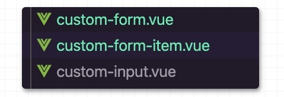

---

title: vue2.0中的provide与inject

meta:
  - name: description
    content: vue2.0中的provide与inject
  - name: keywords
    content: vue2.0中的provide与inject

created: 2020/04/21

updated: 2020/04/21
 
tags:
  - vue
  - vue2.0

---

### 前言
Vue相关的面试经常会被面试官问道，Vue父子之间传值的方式有哪些，通常我们会回答，`props`传值，`$emit`事件传值，`vuex`传值，还有`eventbus`传值等等，今天再加一种`provide`与`inject`传值。
使用过`React`的同学都知道，在`React`中有一个上下文`Context`，组件可以通过`Context`向任意后代传值，而Vue的`provide`与`inject`的作用于`Context`的作用基本一样

### elemment-ui中el-form中的运用
我们在使用`elemment-ui`是经常有以下代码
```js
<template>
  <el-form :model="formData" size="small">
    <el-form-item label="姓名" prop="name">
      <el-input v-model="formData.name" />
    </el-form-item>
    <el-form-item label="年龄" prop="age">
      <el-input-number v-model="formData.age" />
    </el-form-item>
    <el-button>提交</el-button>
  </el-form>
</template>
<script>
export default {
  data() {
    return {
      formData: {
        name: '',
        age: 0
      }
    }
  }
}
</script>
```

看了上面的代码，貌似没啥特殊的，天天写啊。在el-form上面我们指定了一个属性size="small"，然后有没有发现表单里面的所有表单元素以及按钮的 size都变成了small,这个是怎么做到的？接下来我们自己手写一个表单模拟一下

## 自己手写一个表单
我们现在模仿`element-ui`的表单，自己自定义一个，文件目录如下

 

自定义表单`custom-form.vue`

```js
<template>
  <form class="custom-form">
    <slot></slot>
  </form>
</template>
<script>
export default {
  props: {
    // 控制表单元素的大小
    size: {
      type: String,
      default: 'default',
      // size 只能是下面的四个值
      validator(value) {
        return ['default', 'large', 'small', 'mini'].includes(value)
      }
    },
    // 控制表单元素的禁用状态
    disabled: {
      type: Boolean,
      default: false
    }
  },
  // 通过provide将当前表单实例传递到所有后代组件中
  provide() {
    return {
      customForm: this
    }
  }
}
</script>
```
在上面代码中，我们通过`provide`将当前组件的实例传递到后代组件中，`provide`是一个函数，函数返回的是一个对象

自定义表单项`custom-form-item.vue`

没有什么特殊的，只是加了一个`label`,`element-ui`更复杂一些

```js
<template>
  <div class="custom-form-item">
    <label class="custom-form-item__label">{{ label }}</label>
    <div class="custom-form-item__content">
      <slot></slot>
    </div>
  </div>
</template>
<script>
export default {
  props: {
    label: {
      type: String,
      default: ''
    }
  }
}
</script>
```

自定义输入框 `custom-input.vue`
```js
<template>
  <div
    class="custom-input"
    :class="[
      `custom-input--${getSize}`,
      getDisabled && `custom-input--disabled`
    ]"
  >
    <input class="custom-input__input" :value="value" @input="$_handleChange" />
  </div>
</template>
<script>
/* eslint-disable vue/require-default-prop */
export default {
  props: {
    // 这里用了自定义v-model
    value: {
      type: String,
      default: ''
    },
    size: {
      type: String
    },
    disabled: {
      type: Boolean
    }
  },
  // 通过inject 将form组件注入的实例添加进来
  inject: ['customForm'],
  computed: {
    // 通过计算组件获取组件的size, 如果当前组件传入，则使用当前组件的，否则是否form组件的
    getSize() {
      return this.size || this.customForm.size
    },
    // 组件是否禁用
    getDisabled() {
      const { disabled } = this
      if (disabled !== undefined) {
        return disabled
      }
      return this.customForm.disabled
    }
  },
  methods: {
    // 自定义v-model
    $_handleChange(e) {
      this.$emit('input', e.target.value)
    }
  }
}
</script>
```
在form中，我们通过provide返回了一个对象，在input中，我们可以通过inject获取form中返回对象中的项，如上代码inject:['customForm']所示，然后就可以在组件内通过this.customForm调用form实例上面的属性与方法了

在项目中使用
```js
<template>
  <custom-form size="small">
    <custom-form-item label="姓名">
      <custom-input v-model="formData.name" />
    </custom-form-item>
  </custom-form>
</template>
<script>
import CustomForm from '../components/custom-form'
import CustomFormItem from '../components/custom-form-item'
import CustomInput from '../components/custom-input'
export default {
  components: {
    CustomForm,
    CustomFormItem,
    CustomInput
  },
  data() {
    return {
      formData: {
        name: '',
        age: 0
      }
    }
  }
}
</script>

```
执行上面代码，运行结果为：
```js
<form class="custom-form">
  <div class="custom-form-item">
    <label class="custom-form-item__label">姓名</label>
    <div class="custom-form-item__content">
      <!--size=small已经添加到指定的位置了-->
      <div class="custom-input custom-input--small">
        <input class="custom-input__input">
      </div>
    </div>
  </div>
</form>
```

### inject格式说明
除了上面代码中所使用的`inject:['customForm']`写法之外，`inject`还可以是一个对象。且可以指定默认值
修改上例，如果`custom-input`外部没有`custom-form`,则不会注入`customForm`,此时为`customForm`指定默认值

```js
{
  inject: {
    customForm: {
      // 对于非原始值，和props一样，需要提供一个工厂方法
      default: () => ({
        size: 'default'
      })
    }
  }
}

```

如果我们希望`inject`进来的属性的名字不叫`customForm`,而是叫`parentForm`，如下代码

```js
inject: {
    // 注入的属性名称
    parentForm: {
      // 通过 from 指定从哪个属性注入
      from: 'customForm',
      default: () => ({
        size: 'default'
      })
    }
  },
  computed: {
    // 通过计算组件获取组件的size, 如果当前组件传入，则使用当前组件的，否则是否form组件的
    getSize() {
      return this.size || this.parentForm.size
    }
  }

```

## 后记
1. `provide`和`inject`的绑定不是可响应式的。但是，如果你传入的是一个可监听的对象，如上面的customForm: this,那么其对象的属性还是可响应的。

2. `Vue`官网建议`provide` 和 `inject` 主要在开发高阶插件/组件库时使用。不推荐用于普通应用程序代码中。因为`provide`和`inject`在代码中是不可追溯的(ctrl + f可以搜)，建议可以使用`Vuex`代替。 但是，也不是说不能用，在局部功能有时候用了作用还是比较大的。

3. 官方关于更多`provide`和`inject`请查看[这里](https://cn.vuejs.org/v2/api/#provide-inject)