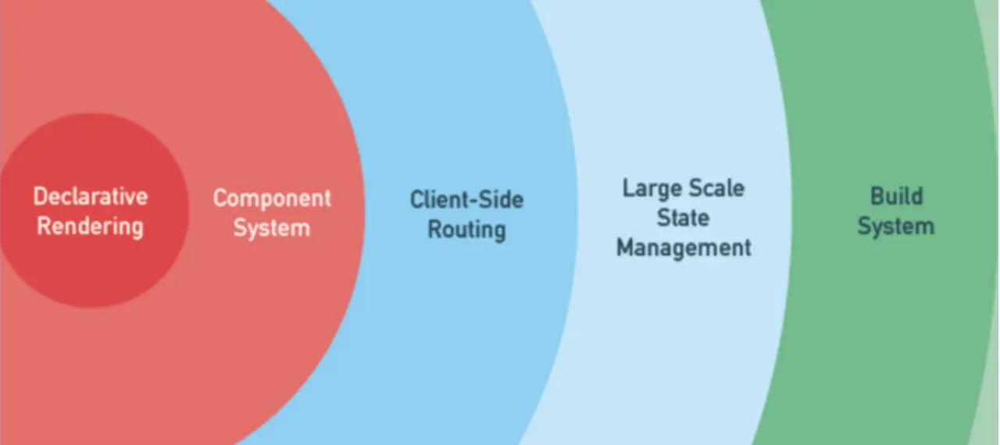
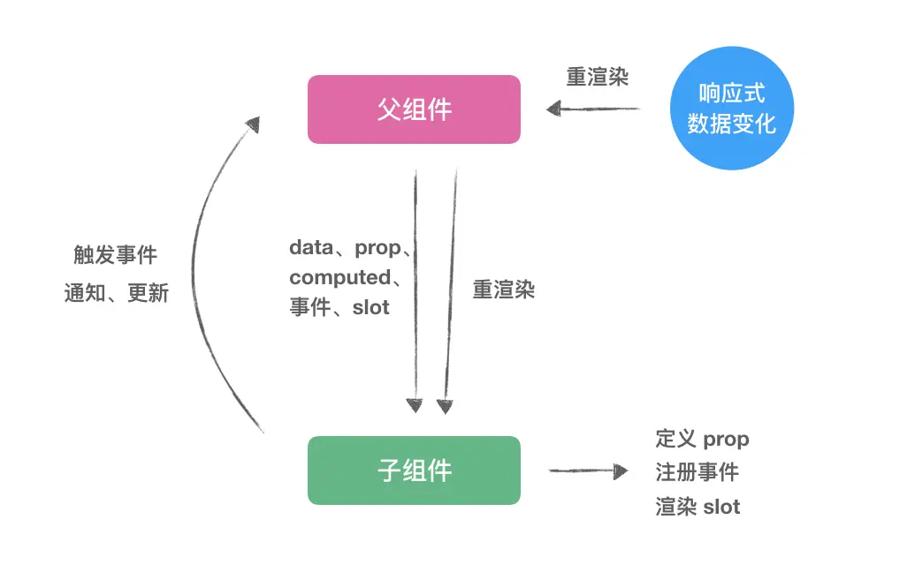
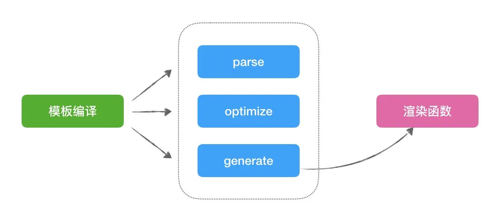
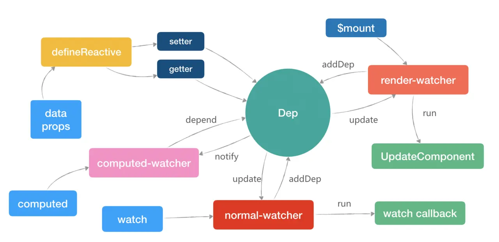
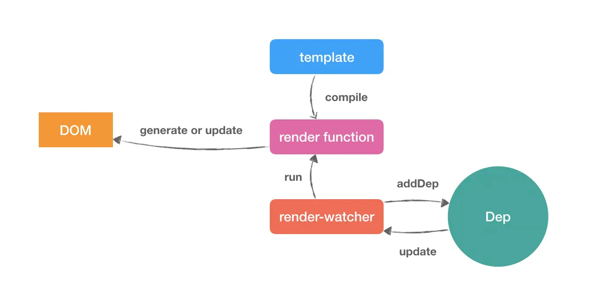
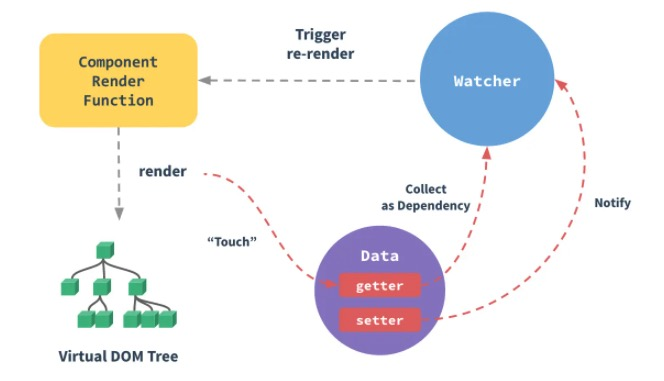

---

title: 聊聊对Vue.js框架的理解

meta:
  - name: description
    content: 聊聊对Vue.js框架的理解
  - name: keywords
    content: 聊聊对Vue.js框架的理解

created: 2020/12/23

updated: 2020/12/23
 
tags:
  - vue

---

## 目标
- 了解 Vue.js 的组件化机制
- 了解 Vue.js 的响应式系统原理
- 了解 Vue.js 中的 Virtual DOM 及 Diff 原理

### Vue.js概述
Vue 是一套用于构建用户界面的渐进式MVVM框架。那怎么理解渐进式呢？渐进式含义：强制主张最少。

 

Vue.js包含了声明式渲染、组件化系统、客户端路由、大规模状态管理、构建工具、数据持久化、跨平台支持等，但在实际开发中，并没有强制要求开发者之后某一特定功能，而是根据需求逐渐扩展。

Vue.js的核心库只关心视图渲染，且由于渐进式的特性，Vue.js便于与第三方库或既有项目整合。

组件机制

定义：组件就是对一个功能和样式进行独立的封装，让HTML元素得到扩展，从而使得代码得到复用，使得开发灵活，更加高效。

与HTML元素一样，Vue.js的组件拥有外部传入的属性（prop）和事件，除此之外，组件还拥有自己的状态（data）和通过数据和状态计算出来的计算属性（computed），各个维度组合起来决定组件最终呈现的样子与交互的逻辑。

### 数据传递
每一个组件之间的作用域是孤立的，这个意味着组件之间的数据不应该出现引用关系，即使出现了引用关系，也不允许组件操作组件内部以外的其他数据。Vue中，允许向组件内部传递prop数据，组件内部需要显性地声明该prop字段，如下声明一个child组件：

```html
<!-- child.vue -->
<template>
    <div>{{msg}}</div>
</template>
<script>
export default {
    props: {
        msg: {
            type: String,
            default: 'hello world' // 当default为引用类型时，需要使用 function 形式返回
        }
    }
}
</script>
```

父组件向该组件传递数据：

```html
<!-- parent.vue -->
<template>
    <child :msg="parentMsg"></child>
</template>
<script>
import child from './child';
export default {
    components: {
        child
    },
    data () {
        return {
            parentMsg: 'some words'
        }
    }
}
</script>
```

### 事件传递
Vue内部实现了一个事件总线系统，即EventBus。在Vue中可以使用 EventBus 来作为沟通桥梁的概念，每一个Vue的组件实例都继承了 EventBus，都可以接受事件$on和发送事件$emit。

如上面一个例子，child.vue 组件想修改 parent.vue 组件的 parentMsg 数据，怎么办呢？为了保证数据流的可追溯性，直接修改组件内 prop 的 msg 字段是不提倡的，且例子中为非引用类型 String，直接修改也修改不了，这个时候需要将修改 parentMsg 的事件传递给 child.vue，让 child.vue 来触发修改 parentMsg 的事件。如：

```html
<!-- child.vue -->
<template>
    <div>{{msg}}</div>
</template>
<script>
export default {
    props: {
        msg: {
            type: String,
            default: 'hello world'
        }
    },
    methods: {
        changeMsg(newMsg) {
            this.$emit('updateMsg', newMsg);
        }
    }
}
</script>
```

父组件：

```html
<!-- parent.vue -->
<template>
    <child :msg="parentMsg" @updateMsg="changeParentMsg"></child>
</template>
<script>
import child from './child';
export default {
    components: {
        child
    },
    data () {
        return {
            parentMsg: 'some words'
        }
    },
    methods: {
        changeParentMsg: function (newMsg) {
            this.parentMsg = newMsg
        }
    }
}
</script>
```

父组件 parent.vue 向子组件 child.vue 传递了 updateMsg 事件，在子组件实例化的时候，子组件将 updateMsg 事件使用$on函数注册到组件内部，需要触发事件的时候，调用函数this.$emit来触发事件。

除了父子组件之间的事件传递，还可以使用一个 Vue 实例为多层级的父子组件建立数据通信的桥梁，如：

```js
const eventBus = new Vue();

// 父组件中使用$on监听事件
eventBus.$on('eventName', val => {
    //  ...do something
})

// 子组件使用$emit触发事件
eventBus.$emit('eventName', 'this is a message.');
```

除了$on和$emit以外，事件总线系统还提供了另外两个方法，$once和$off，所有事件如下：
- $on：监听、注册事件。
- $emit：触发事件。
- $once：注册事件，仅允许该事件触发一次，触发结束后立即移除事件。
- $off：移除事件。

### 内容分发
Vue实现了一套遵循 Web Components 规范草案 的内容分发系统，即将`<slot>`元素作为承载分发内容的出口。

插槽slot，也是组件的一块HTML模板，这一块模板显示不显示、以及怎样显示由父组件来决定。实际上，一个slot最核心的两个问题在这里就点出来了，是显示不显示和怎样显示。

插槽又分默认插槽、具名插槽。

### 默认插槽
又名单个插槽、匿名插槽，与具名插槽相对，这类插槽没有具体名字，一个组件只能有一个该类插槽。

```html
<template>
<!-- 父组件 parent.vue -->
<div class="parent">
  <h1>父容器</h1>
  <child>
    <div class="tmpl">
      <span>菜单1</span>
    </div>
  </child>
</div>
</template>
```

```html
<template>
<!-- 子组件 child.vue -->
<div class="child">
  <h1>子组件</h1>
  <slot></slot>
</div>
</template>
```

如上，渲染时子组件的slot标签会被父组件传入的div.tmpl替换。

### 具名插槽
匿名插槽没有name属性，所以叫匿名插槽。那么，插槽加了name属性，就变成了具名插槽。具名插槽可以在一个组件中出现N次，出现在不同的位置，只需要使用不同的name属性区分即可。

```html
<template>
<!-- 父组件 parent.vue -->
<div class="parent">
  <h1>父容器</h1>
  <child>
    <div class="tmpl" slot="up">
      <span>菜单up-1</span>
    </div>
    <div class="tmpl" slot="down">
      <span>菜单down-1</span>
    </div>
    <div class="tmpl">
      <span>菜单->1</span>
    </div>
  </child>
</div>
</template>
```

```html
<template>
  <div class="child">
    <!-- 具名插槽 -->
    <slot name="up"></slot>
    <h3>这里是子组件</h3>
    <!-- 具名插槽 -->
    <slot name="down"></slot>
    <!-- 匿名插槽 -->
    <slot></slot>
  </div>
</template>
```

如上，slot 标签会根据父容器给 child 标签内传入的内容的 slot 属性值，替换对应的内容。

其实，默认插槽也有 name 属性值，为default，同样指定 slot 的 name 值为 default，一样可以显示父组件中传入的没有指定slot的内容。

### 作用域插槽
作用域插槽可以是默认插槽，也可以是具名插槽，不一样的地方是，作用域插槽可以为 slot 标签绑定数据，让其父组件可以获取到子组件的数据。

```html
<template>
  <!-- parent.vue -->
  <div class="parent">
    <h1>这是父组件</h1>
    <current-user>
      <template slot="default" slot-scope="slotProps">
        {{ slotProps.user.name }}
      </template>
    </current-user>
  </div>
</template>
```

```html
<template>
    <!-- child.vue -->
    <div class="child">
        <h1>这是子组件</h1>
        <slot :user="user"></slot>
    </div>
</template>
<script>
export default {
  data() {
    return {
      user: {
        name: '小赵'
      }
    }
  }
}
</script>
```

如上例子，子组件 child 在渲染默认插槽 slot 的时候，将数据 user 传递给了 slot 标签，在渲染过程中，父组件可以通过slot-scope属性获取到 user 数据并渲染视图。

slot 实现原理：当子组件vm实例化时，获取到父组件传入的 slot 标签的内容，存放在vm.$slot中，默认插槽为vm.$slot.default，具名插槽为vm.$slot.xxx，xxx 为 插槽名，当组件执行渲染函数时候，遇到<slot>标签，使用$slot中的内容进行替换，此时可以为插槽传递数据，若存在数据，则可曾该插槽为作用域插槽。

至此，父子组件的关系如下图：

 

### 模板渲染
Vue.js 的核心是声明式渲染，与命令式渲染不同，声明式渲染只需要告诉程序，我们想要的什么效果，其他的事情让程序自己去做。而命令式渲染，需要命令程序一步一步根据命令执行渲染。如下例子区分：

```js
var arr = [1, 2, 3, 4, 5];

// 命令式渲染，关心每一步、关心流程。用命令去实现
var newArr = [];
for (var i = 0; i < arr.length; i++) {
    newArr.push(arr[i] * 2);
}

// 声明式渲染，不用关心中间流程，只需要关心结果和实现的条件
var newArr1 = arr.map(function (item) {
    return item * 2;
});
```

Vue.js 实现了if、for、事件、数据绑定等指令，允许采用简洁的模板语法来声明式地将数据渲染出视图。

### 模板编译
为什么要进行模板编译？实际上，我们组件中的 template 语法是无法被浏览器解析的，因为它不是正确的 HTML 语法，而模板编译，就是将组件的 template 编译成可执行的 JavaScript 代码，即将 template 转化为真正的渲染函数。

模板编译分三个阶段，parse(解析)、optimize(优化)、generate(生成)，最终生成render函数。

 

parse阶段：使用正则表达式将template进行字符串解析，得到指令、class、style等数据，生成抽象语法树 AST。

optimize阶段：寻找 AST 中的静态节点进行标记，为后面 VNode 的 patch 过程中对比做优化。被标记为 static 的节点在后面的 diff 算法中会被直接忽略，不做详细的比较。

generate阶段：根据 AST 结构拼接生成 render 函数的字符串。

### 预编译
对于 Vue 组件来说，模板编译只会在组件实例化的时候编译一次，生成渲染函数之后在也不会进行编译。因此，编译对组件的 runtime 是一种性能损耗。而模板编译的目的仅仅是将template转化为render function，而这个过程，正好可以在项目构建的过程中完成。

比如webpack的vue-loader依赖了vue-template-compiler模块，在 webpack 构建过程中，将template预编译成 render 函数，在 runtime 可直接跳过模板编译过程。

回过头看，runtime 需要是仅仅是 render 函数，而我们有了预编译之后，我们只需要保证构建过程中生成 render 函数就可以。与 React 类似，在添加JSX的语法糖编译器babel-plugin-transform-vue-jsx之后，我们可以在 Vue 组件中使用JSX语法直接书写 render 函数。

```js
<script>
export default {
  data() {
    return {
      msg: 'Hello JSX.'
    }
  },
  render() {
    const msg = this.msg;
    return <div>
      {msg}
    </div>;
  }
}
</script>
```

如上面组件，使用 JSX 之后，可以在 JS 代码中直接使用 html 标签，而且声明了 render 函数以后，我们不再需要声明 template。当然，假如我们同时声明了 template 标签和 render 函数，构建过程中，template 编译的结果将覆盖原有的 render 函数，即 template 的优先级高于直接书写的 render 函数。

相对于 template 而言，JSX 具有更高的灵活性，面对与一些复杂的组件来说，JSX 有着天然的优势，而 template 虽然显得有些呆滞，但是代码结构上更符合视图与逻辑分离的习惯，更简单、更直观、更好维护。

需要注意的是，最后生成的 render 函数是被包裹在with语法中运行的。

### 小结
Vue 组件通过 prop 进行数据传递，并实现了数据总线系统EventBus，组件集成了EventBus进行事件注册监听、事件触发，使用slot进行内容分发。

除此以外，实现了一套声明式模板系统，在runtime或者预编译是对模板进行编译，生成渲染函数，供组件渲染视图使用。


### 响应式系统
Vue.js 是一款 MVVM 的JS框架，当对数据模型data进行修改时，视图会自动得到更新，即框架帮我们完成了更新DOM的操作，而不需要我们手动的操作DOM。可以这么理解，当我们对数据进行赋值的时候，Vue 告诉了所有依赖该数据模型的组件，你依赖的数据有更新，你需要进行重渲染了，这个时候，组件就会重渲染，完成了视图的更新。

### 数据模型 && 计算属性 && 监听器

在组件中，可以为每个组件定义数据模型data、计算属性computed、监听器watch。

数据模型：Vue 实例在创建过程中，对数据模型data的每一个属性加入到响应式系统中，当数据被更改时，视图将得到响应，同步更新。data必须采用函数的方式 return，不使用 return 包裹的数据会在项目的全局可见，会造成变量污染；使用return包裹后数据中变量只在当前组件中生效，不会影响其他组件。

计算属性：computed基于组件响应式依赖进行计算得到结果并缓存起来。只在相关响应式依赖发生改变时它们才会重新求值，也就是说，只有它依赖的响应式数据（data、prop、computed本身）发生变化了才会重新计算。那什么时候应该使用计算属性呢？模板内的表达式非常便利，但是设计它们的初衷是用于简单运算的。在模板中放入太多的逻辑会让模板过重且难以维护。对于任何复杂逻辑，你都应当使用计算属性。

监听器：监听器watch作用如其名，它可以监听响应式数据的变化，响应式数据包括 data、prop、computed，当响应式数据发生变化时，可以做出相应的处理。当需要在数据变化时执行异步或开销较大的操作时，这个方式是最有用的。

### 响应式原理
在 Vue 中，数据模型下的所有属性，会被 Vue 使用Object.defineProperty（Vue3.0 使用 Proxy）进行数据劫持代理。响应式的核心机制是观察者模式，数据是被观察的一方，一旦发生变化，通知所有观察者，这样观察者可以做出响应，比如当观察者为视图时，视图可以做出视图的更新。

Vue.js 的响应式系统以来三个重要的概念，Observer、Dep、Watcher。

### 发布者-Observer
Observe 扮演的角色是发布者，他的主要作用是在组件vm初始化的时，调用defineReactive函数，使用Object.defineProperty方法对对象的每一个子属性进行数据劫持/监听，即为每个属性添加getter和setter，将对应的属性值变成响应式。

在组件初始化时，调用initState函数，内部执行initState、initProps、initComputed方法，分别对data、prop、computed进行初始化，让其变成响应式。

初始化props时，对所有props进行遍历，调用defineReactive函数，将每个 prop 属性值变成响应式，然后将其挂载到_props中，然后通过代理，把vm.xxx代理到vm._props.xxx中。

同理，初始化data时，与prop相同，对所有data进行遍历，调用defineReactive函数，将每个 data 属性值变成响应式，然后将其挂载到_data中，然后通过代理，把vm.xxx代理到vm._data.xxx中。

初始化computed，首先创建一个观察者对象computed-watcher，然后遍历computed的每一个属性，对每一个属性值调用defineComputed方法，使用Object.defineProperty将其变成响应式的同时，将其代理到组件实例上，即可通过vm.xxx访问到xxx计算属性。

### 调度中心/订阅器-Dep
Dep 扮演的角色是调度中心/订阅器，在调用defineReactive将属性值变成响应式的过程中，也为每个属性值实例化了一个Dep，主要作用是对观察者（Watcher）进行管理，收集观察者和通知观察者目标更新，即当属性值数据发生改变时，会遍历观察者列表（dep.subs），通知所有的 watcher，让订阅者执行自己的update逻辑。

其dep的任务是，在属性的getter方法中，调用dep.depend()方法，将观察者（即 Watcher，可能是组件的render function，可能是 computed，也可能是属性监听 watch）保存在内部，完成其依赖收集。在属性的setter方法中，调用dep.notify()方法，通知所有观察者执行更新，完成派发更新。

### 观察者-Watcher
Watcher 扮演的角色是订阅者/观察者，他的主要作用是为观察属性提供回调函数以及收集依赖，当被观察的值发生变化时，会接收到来自调度中心Dep的通知，从而触发回调函数。

而Watcher又分为三类，normal-watcher、 computed-watcher、 render-watcher。

- normal-watcher：在组件钩子函数watch中定义，即监听的属性改变了，都会触发定义好的回调函数。
- computed-watcher：在组件钩子函数computed中定义的，每一个computed属性，最后都会生成一个对应的Watcher对象，但是这类Watcher有个特点：当计算属性依赖于其他数据时，属性并不会立即重新计算，只有之后其他地方需要读取属性的时候，它才会真正计算，即具备lazy（懒计算）特性。
- render-watcher：每一个组件都会有一个render-watcher, 当data/computed中的属性改变的时候，会调用该Watcher来更新组件的视图。

这三种Watcher也有固定的执行顺序，分别是：computed-render -> normal-watcher -> render-watcher。这样就能尽可能的保证，在更新组件视图的时候，computed 属性已经是最新值了，如果 render-watcher 排在 computed-render 前面，就会导致页面更新的时候 computed 值为旧数据。

 

Observer 负责将数据进行拦截，Watcher 负责订阅，观察数据变化， Dep 负责接收订阅并通知 Observer 和接收发布并通知所有 Watcher。


### Virtual DOM

在 Vue 中，template被编译成浏览器可执行的render function，然后配合响应式系统，将render function挂载在render-watcher中，当有数据更改的时候，调度中心Dep通知该render-watcher执行render function，完成视图的渲染与更新。

 

整个流程看似通顺，但是当执行render function时，如果每次都全量删除并重建 DOM，这对执行性能来说，无疑是一种巨大的损耗，因为我们知道，浏览器的DOM很“昂贵”的，当我们频繁的更新 DOM，会产生一定的性能问题。

为了解决这个问题，Vue 使用 JS 对象将浏览器的 DOM 进行的抽象，这个抽象被称为 Virtual DOM。Virtual DOM 的每个节点被定义为VNode，当每次执行render function时，Vue 对更新前后的VNode进行Diff对比，找出尽可能少的我们需要更新的真实 DOM 节点，然后只更新需要更新的节点，从而解决频繁更新 DOM 产生的性能问题。

### VNode

VNode，全称virtual node，即虚拟节点，对真实 DOM 节点的虚拟描述，在 Vue 的每一个组件实例中，会挂载一个$createElement函数，所有的VNode都是由这个函数创建的。

```js
// 声明 render function
render: function (createElement) {
    // 也可以使用 this.$createElement 创建 VNode
    return createElement('div', 'hello world');
}
// 以上 render 方法返回html片段 <div>hello world</div>
```

```html
<div>
    <p>123</p>
</div>
```
对应的virtual DOM（伪代码）：

```js
var Vnode = {
  tag: 'div',
  children: [
    { tag: 'p', text: '123' }
  ]
};
```

render 函数执行后，会根据VNode Tree将 VNode 映射生成真实 DOM，从而完成视图的渲染。

### Diff
Diff 将新老 VNode 节点进行比对，然后将根据两者的比较结果进行最小单位地修改视图，而不是将整个视图根据新的 VNode 重绘，进而达到提升性能的目的。

关于更多Diff算法的内部实现[https://www.jianshu.com/p/398e63dc1969](https://www.jianshu.com/p/398e63dc1969)

### 总结
官方图

 

Vue.js 实现了一套声明式渲染引擎，并在runtime或者预编译时将声明式的模板编译成渲染函数，挂载在观察者 Watcher 中，在渲染函数中（touch），响应式系统使用响应式数据的getter方法对观察者进行依赖收集（Collect as Dependency），使用响应式数据的setter方法通知（notify）所有观察者进行更新，此时观察者 Watcher 会触发组件的渲染函数（Trigger re-render），组件执行的 render 函数，生成一个新的 Virtual DOM Tree，此时 Vue 会对新老 Virtual DOM Tree 进行 Diff，查找出需要操作的真实 DOM 并对其进行更新。
